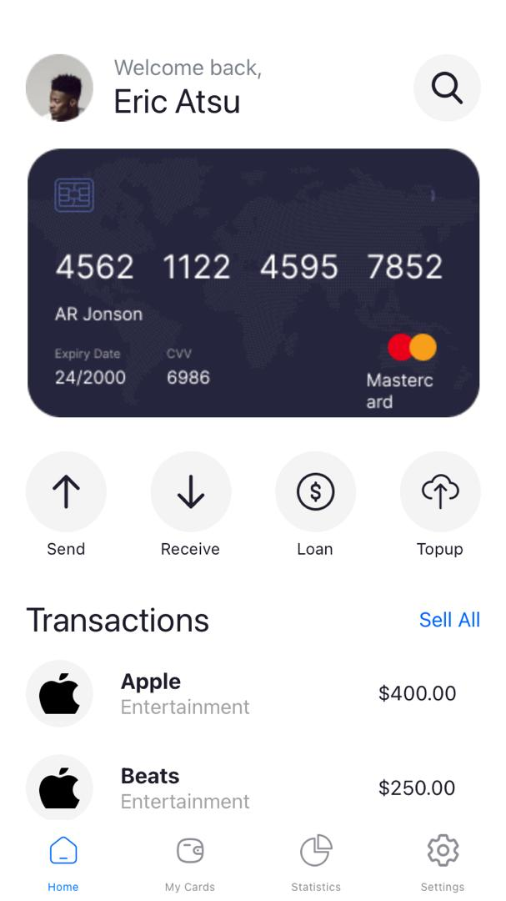
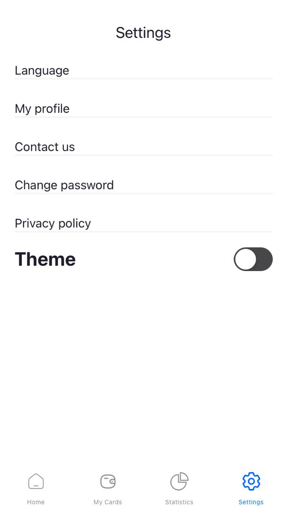
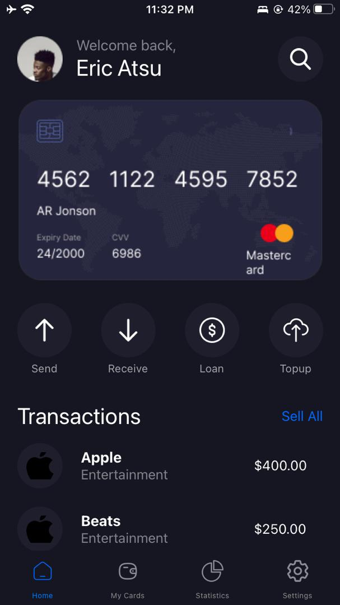
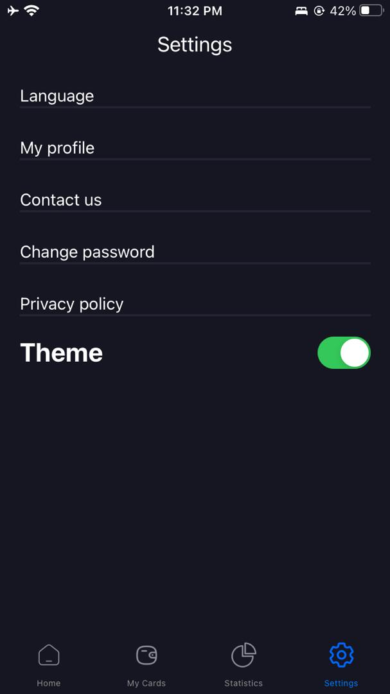

# React Native Application
## Student ID: 11014111
### Project Overview
This is a React Native application created using Expo CLI. It was created for my fifth assignment in Mobile Application Development. 

### What does this app do?
The app is some kind of financial app

### Project Structure
- [`app-screenshots`](./app-screenshots/): Contains screenshots of the application
- [`assets`](./assets/): Contains images and other assets used in the application, such as logos and icons
- [`components`](./components/): Contains all reusable components used across different parts of the application. Each component is organized in a relevant subfolder
- [`pages`](./screens/): Contains the main screens (home, my cards, statistics, settings)
- [`styles`](./styles/): Contains styling files for the components and pages
- [`App.js`](./App.js): Main entry point of the app. It sets up the root component and navigation
- [`app.json`](./app.json): Configuration file for the Expo project, defining project settings and metadata
- [`babel.config.js`](./babel.config.js): Babel configuration file, used to specify how JavaScript code is compiled
- [`package-lock.json`](./package-lock.json): Automatically generated file that describes the exact tree of dependencies that were installed for the project
- [`package.json`](./package.json): Contains metadata about the project, including dependencies, scripts, and project info
- [`README.md`](./README.md): This README file, providing an overview and documentation for the project

### Components Structure And Usage
- #### HomeScreen
    - Card
    - Operations
    - ProfileAndSearch
    - Transactions
- #### SettingsScreen
    - Settings categories
    - ThemeSetting
        - The theme setting component allows a user to change the theme of the entire app using a custom component AppContext, and the react useContext hook
- #### App 
    - NavBar
        - Contains navigation process between all the screens
        - Uses tab navigation
- #### Other screens
    - MyCardsScreen
    - StatisticsScreen

### Technology Stack Used

- React Native
- Expo CLI
- Other dependencies found in the [`package.json`](./package.json) file

### Clone This Repository
- Open your terminal and navigate to the folder you want this repository to be cloned.
- Paste the following command
```
git clone https://github.com/favourrr-a/rn-assignment5-11014111.git
```
- Navigate to the project directory
```
cd rn-assignment5-11014111
```
### Screenshots Of The Application
#### Light theme


### Dark theme



